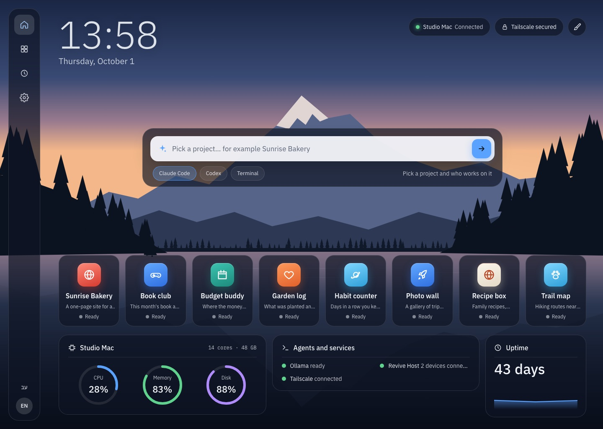

<p align="center">
  
</p>

<h1 align="center">Revive</h1>

<p align="center">
  <b>A calm home for everything you build with AI.</b><br>
  Revive finds every project in your folder, tells you in plain words what each one is, and runs it with one click.
</p>

<p align="center">
  <a href="https://igaltal.github.io/revive/"><b>Website</b></a> ·
  <a href="https://github.com/igaltal/revive/releases/latest/download/Revive.dmg"><b>Download for Mac</b></a> ·
  <a href="CHANGELOG.md">What's new</a>
</p>

<p align="center">
  
</p>

## What it does

- **Finds your projects.** Point it at the folder you build in. Revive works out, on your Mac and in seconds, what each project is made of, how it starts, which port it opens and which keys it needs.
- **Explains them in plain words.** Claude Code writes one sentence per project, in English and Hebrew, from a short summary (it never sees your files). About 2 cents a project; unchanged projects cost nothing.
- **Runs them with one click,** with a live preview and a one-sentence reason when something's wrong.
- **Goes back in time.** Saved versions with plain titles; go back for one project or all of them, and undo that too.
- **Keeps agents running.** Claude Code, Codex and terminals run in tmux (bundled), so they keep going when Revive is closed.
- **Reaches your phone.** Share your Mac with your own devices over Tailscale, with pairing, a device list and an activity log.
- **Two looks, two languages.** Scenic (glass over a live landscape) or Paper, in English or Hebrew, right to left and left to right.

## Download

**[Revive.dmg](https://github.com/igaltal/revive/releases/latest/download/Revive.dmg)**, for macOS 11 or later on Apple silicon and Intel.

Open it, drag Revive onto Applications, and open it from there. This early-access build isn't notarized by Apple yet: the first time, open **System Settings → Privacy & Security** and click **Open Anyway** next to Revive (or run `xattr -dr com.apple.quarantine /Applications/Revive.app`).

To read a folder you need [Claude Code](https://code.claude.com/docs/en/setup) signed in; Revive can install it for you.

## Build from source

Requirements: macOS, Node.js 24, Xcode command line tools.

```sh
npm ci
npm run dev                 # the app, with hot reload
npm run typecheck && npm run lint && npm test && npm run test:e2e
npm run dist                # a universal .dmg in release/ (builds the bundled tmux first)
```

Signing and notarization switch on with environment variables (a Developer ID certificate and an App Store Connect API key); see `electron-builder.config.cjs` and `PLAN.md` (M11). Releases are built by `.github/workflows/release.yml` from a version tag.

## How it's built

Electron, React and TypeScript. The renderer only talks to the rest of the app through one typed contract (`src/shared/contract.ts`), the same over IPC and over the WebSocket a paired phone uses. `PLAN.md` records every milestone and decision.

## License

© 2026 Igal Tal Merom. All rights reserved. The source is published so you can read it, build it and run it yourself; it isn't licensed for redistribution or reuse in other products.
